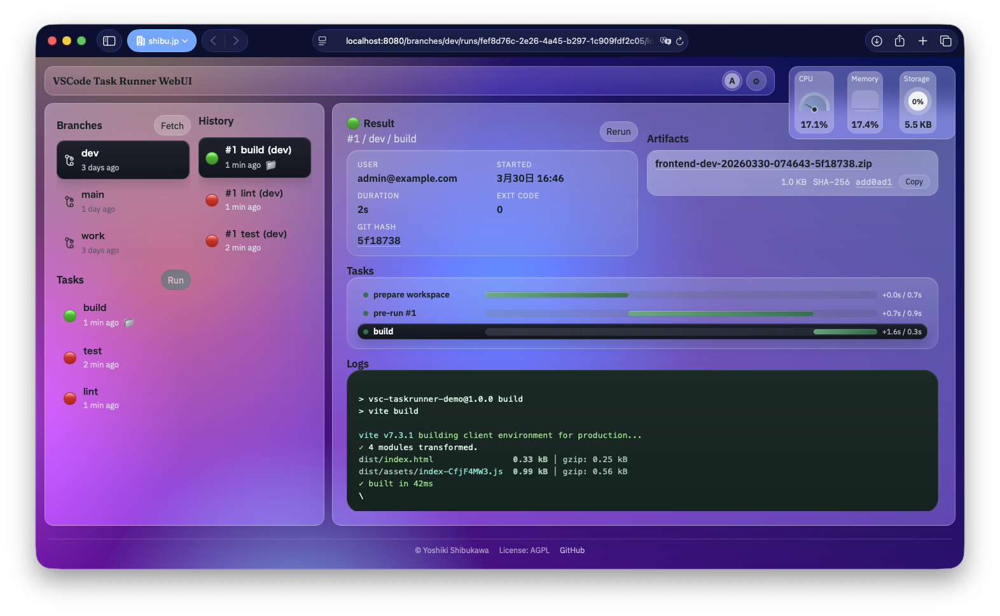

# runtask

runtask is a tool for working with VS Code `.vscode/tasks.json` outside VS Code. It can run existing tasks from the CLI, help you generate `.vscode/tasks.json`, and provide a Web UI mode that lets you run tasks from a browser.



## Running tasks.json

- List tasks defined in `.vscode/tasks.json`
- Dry-run tasks before execution
- Run tasks, including input values, parallel or sequential execution, and dependency handling

> [!NOTE]
> Only a single workspace is supported.
> - `command:*`, `config:*`, and `file*` variables are not supported yet
> - Provider-like tasks must be converted into explicit command definitions before execution

### Basic usage

List tasks:

```sh
runtask list
runtask list --json
```

Dry-run:

```sh
# `npm-test` is the task label
runtask npm-test --dry-run
```

Run a task:

```sh
runtask go-test
runtask tsc-build-tsconfig.json
```

You can still use `runtask run <task-name>`, but in normal use the shorter `runtask <task-name>` form is enough. If a task has dependencies, they are executed according to its `dependsOn` definition.

## tasks.json authoring support

In VS Code, some extensions can infer runnable tasks from the project layout even when you have not written task definitions yourself. runtask does not execute VS Code extensions directly, but it can inspect a number of language and build-tool configurations and help you register equivalent commands into `.vscode/tasks.json`.

Using this support after creating a project skeleton makes it easier to standardize local commands and later reuse the same tasks from VS Code debugging or the CLI.

### Add tasks with `runtask add`

`runtask add` is a helper command for adding tasks to `.vscode/tasks.json` without writing them by hand. The main workflows are interactive custom task creation and detection-based task generation.

Interactive add:

```sh
runtask add
```

Inspect detected tasks:

```sh
runtask add detect
runtask add detect --json
```

Save detected tasks:

```sh
runtask add detect --save --ecosystem npm
runtask add detect --save --label npm-test
runtask add detect --save --ecosystem gulp --all
```

### Supported task generation

The following ecosystems are currently supported.

- Provider-like tasks: `npm` / `typescript` / `gulp` / `grunt` / `jake`
- Generated command tasks: `go` / `rust` / `swift` / `gradle` / `maven`

Common examples:

```sh
# Add npm scripts in bulk
runtask add npm --all

# Add build / watch tasks for TypeScript
runtask add typescript --all

# Add build / test / bench / cover / lint for Go
runtask add go

# Add build / test / check / bench for Rust
runtask add rust
```

## Web UI mode

In Web UI mode, you can select branches and tasks in a browser, run them against a Git repository, and inspect run history and artifacts later. It is designed both for always-on services and for serverless-style environments.

CLI mode runs `.vscode/tasks.json` in the current local workspace. Web UI mode is aimed more at CI-like execution. It does not try to expose every advanced setting through the browser itself.

> [!NOTE]
> Git submodules are not supported.

### How Web UI mode behaves

- CLI mode runs in your current working tree without Git operations. Web UI mode lets you choose a branch, prepares a workspace from that branch's HEAD, and then runs the task there.
- CLI mode only uses `.vscode/tasks.json`. Web UI mode also relies on `runtask-ui.yaml` for extra settings such as exposed branches and tasks, pre-run tasks, artifacts, history retention, worktree retention, and authentication/authorization.
- CLI mode assumes required dependencies are already available. Web UI mode can define additional preparation steps such as package installation for clean builds.
- Run results are stored as history, and artifacts or preserved work folders can be reviewed later.

There is also an option to run only the commands defined in `.vscode/tasks.json` without creating a repository workspace.

### Web UI configuration

The configuration file for Web UI mode is `runtask-ui.yaml`. You can generate the initial skeleton with `ui init`.

```sh
# Generate the initial configuration interactively
runtask ui init

# Preview the generated config without writing a file
runtask ui init --write=false
```

After that, you can make simple edits to the exposed tasks and branches with helper commands.

```sh
runtask ui edit task
runtask ui edit branch
```

These helper commands are best for adjusting which tasks or branches are exposed. For detailed settings such as authentication, authorization, and runtime mode, edit `runtask-ui.yaml` directly. `llms.txt` and configuration-editing skills are available in the repository.

Start the Web UI service:

```sh
runtask ui
```

### Task configuration details

In Web UI mode, each task can define pre-run steps, artifacts, history retention, and work folder retention. A representative example looks like this.

```yaml
tasks:
  build:
    # Pre-run tasks
    preRunTask:
      - command: npm
        args:
          - ci
        cwd: ${workspaceFolder}
    # Artifacts
    artifacts:
      - path: dist
        format: zip
        nameTemplate: frontend-{branch}-b{buildno}-{yyyymmdd}-{hhmmss}-{hash}.zip
    # Per-task history retention
    historyKeepCount: 10
    # Work folder retention
    worktree:
      # Set true for lightweight execution without expanding repository files
      disabled: false
      keepOnSuccess: 0
      keepOnFailure: 5

# Global storage settings (task-level settings take precedence)
storage:
  historyKeepCount: 50
  worktree:
    keepOnSuccess: 0
    keepOnFailure: 2
```

- `preRunTask`: preparation steps that run once before the main task, such as `npm ci`
- `artifacts`: files or directories kept for download after a run
- `historyKeepCount`: how many run history entries to keep; if not overridden per task, `storage.historyKeepCount` is used
- `worktree.disabled`: a flag for tasks that should not expand the full repository into the work directory
- `worktree.keepOnSuccess` / `keepOnFailure`: how many work folders to preserve for successful and failed runs

The following placeholders are available in artifact file name templates.

- `{buildno}`: build number
- `{yyyymmdd}`: date in UTC
- `{hhmmss}`: time in UTC
- `{yyyymmddhhmmss}`: timestamp in UTC
- `{hash}`: short Git hash (first 7 characters)
- `{longhash}`: full Git hash
- `{branch}`: branch name

### API access

The Web UI supports both browser-based operation and API-based execution with access tokens. This is useful for scheduled runs or integrations with external systems.

Administrators can issue tokens from the Web UI settings screen. Tokens can be granted scopes depending on their intended use.

- `runs:read`: read run history and results
- `runs:write`: start tasks

Typical API endpoints include the following. The token issuance screen can generate ready-to-copy `curl` commands.

- `GET /api/me`: current user information and permissions
- `GET /api/runs`: list run history
- `POST /api/runs`: start a task
- `GET /api/runs/{runId}`: fetch run details
- `GET /api/runs/{runId}/artifacts`: list artifacts
- `GET /api/runs/{runId}/worktree.zip`: download a preserved work folder

Example request:

```sh
curl -H 'Authorization: Bearer <token>' \
  -H 'Content-Type: application/json' \
  -X POST http://localhost:8080/api/runs \
  -d '{"branch":"main","taskLabel":"build","inputValues":{}}'
```

### Authentication and authorization

For local verification only, you can run with `auth.noAuth: true`. For shared environments, runtask supports OIDC.

```yaml
auth:
  oidcIssuer: https://issuer.example.com
  oidcClientID: runtask
  oidcClientSecret: ${OIDC_CLIENT_SECRET}
  sessionSecret: ${SESSION_SECRET}
  allowUsers:
    role:
      - runner
  adminUsers:
    role:
      - admin
  apiTokens:
    enabled: true
```

- `allowUsers`: conditions for users who are allowed to use the Web UI; if omitted, all authenticated users are allowed
- `adminUsers`: conditions for users who can inspect settings and manage API tokens; conditions are written against claim keys using glob-style matching
- `apiTokens.enabled`: enables the API token feature for shared environments and integrations

### Environment setup

- Publish the service by setting `server.host`, `server.port`, and `server.publicURL`

#### Always-on mode

This is the simplest setup: run the Web UI as a continuously running service on one server.

- With `storage.backend: local`, history and artifacts are stored on the local disk
- Because the same machine keeps history and repository cache, repeated runs can benefit from caching efficiently

#### Serverless mode

This mode is designed for environments such as Google Cloud Run functions, AWS Lambda, or AWS ECS, where server resources are used only when requests arrive. Build tasks themselves can still run, but if there are no active instances, the attached block storage may be reset. That means `.git` clones and downloaded package caches can disappear between runs. For large projects, prefer always-on mode or mount persistent storage such as AWS EFS so the work directory and caches survive.

In serverless mode, run results, artifacts, and preserved work folders are typically stored in S3-compatible object storage.

```yaml
storage:
  backend: object
  object:
    endpoint: https://s3.example.com
    bucket: runtask
    region: ap-northeast-1
```

## License

This project is distributed under the GNU Affero General Public License v3.0 or later.
See [LICENSE](LICENSE).